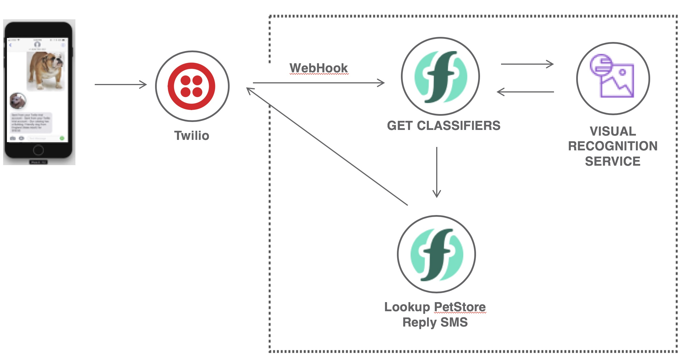

# All Things Open 2018 Conf. - Serverless Swift Demo

This is a simple example using Swift to build a Serverless Application that leverages IBM Watson Visual Recognition.

[Slides here](AllThingsOpen2018-Serverless-Swift.pdf)

The application receives a pictures using Twilio SMS service, it does visual recognition on the image to detect the type of pet, then searches the demo Pet Store to find a matching pet, and replies back with a SMS response with a description and price.



# Prerequisites

- Get a free account for [IBM Cloud Functions](https://console.bluemix.net), there is a free montly tier of 400GBs

- Install the [IBM Cloud CLI](https://console.bluemix.net/docs/cli/reference/bluemix_cli/download_cli.html) and setup the [IBM Cloud Functions Plugin](https://console.bluemix.net/openwhisk/learn/cli)

- Setup a new [Watson Recognition Service](https://console.bluemix.net/catalog/services/visual-recognition) from the Catalog

- Install [jq](https://stedolan.github.io/jq/) (brew install jq)

## Test the CLI with a hello world
Test the CLI setup with hello world swift example
```
bx wsk action update hello hello.swift --kind swift:4.1 --web true
bx wsk action invoke hello -r -p name Carlos
```
```json
{
    "body": "Hello Carlos!"
}
```
Get the Web Action URL
```
bx wsk action get --url
```
Open a browser using the output URL

## Setup Twilio Free trial account
- Get a trial account and request a phone number [Twilio](https://www.twilio.com)
- Request a phone number for SMS
- Configure the phone number with a SMS
- When you deploy the action using `deloy.sh` the Web Action URL will print
- Setup a WebHook for the phone number using the URL from the previous step

# Deploy
Run the `deploy.sh` script
```
./deploy.sh
```
Use the Web Action URL and enter the value in the Twilio Console to configure the webhook for the phone number.

# Test
Invoke the deployed action using `curl` to call the Web API
```
./run.sh
```

# Use XCode to Develop and Debug
Make sure swift CLI is setup correctly with Swift 4.1 or 4.2
```
cd actions/GetClassifier/
swift build
```
Generate an XCode project using Swift Package Manager (spm)
```
swift package generate generate-xcodeproj
```

## Using XCode project
Open the new Xcode project
```
open ./Action.xcodeproj
```

Open the [Sources/main.swift](actions/GetClassifier/Sources/Action/main.swift) file this file will allow you to run the Action locally and be able to debug the function in the Action.
Set the environment variable `WATSON_API_KEY` in XCode Product->Scheme=>Edit Scheme you can get the value from the IBM Cloud Console in the Watson Recognition Service instance you created.

The file `main.swift` is only to be use for debugging locally, the file `GetClassifier.swift` and `PostSMSMessage.swift` are the files that contain the Action code that gets deployed to the cloud.


## Bonus
There is a swift action [PostSMSMessage.swift](actions/GetClassifier/Sources/Action/PostSMSMessage.swift) to be used as a general purpose SMS notification. This Action can be use in case you want to reply right away to the SMS, and then async do the processing for the pet and eventually get back to the user by posting a SMS at a later time.
- Get the account id, auth token and phone number twilio gave you, and your own phone number verified to test the app
- Create `secrets.env` using `secrets.env.template` as template
```
cp secrets.env.template secrets.env
```
- Replace the values in `secrets.env`
- Uncomment in `deploy.sh` the line `#deploy_post_sms`
- Uncomment in `test.sh` the line `#test_post_sms`


#### LICENSE
[Apache-2.0](./LICENSE.txt)
